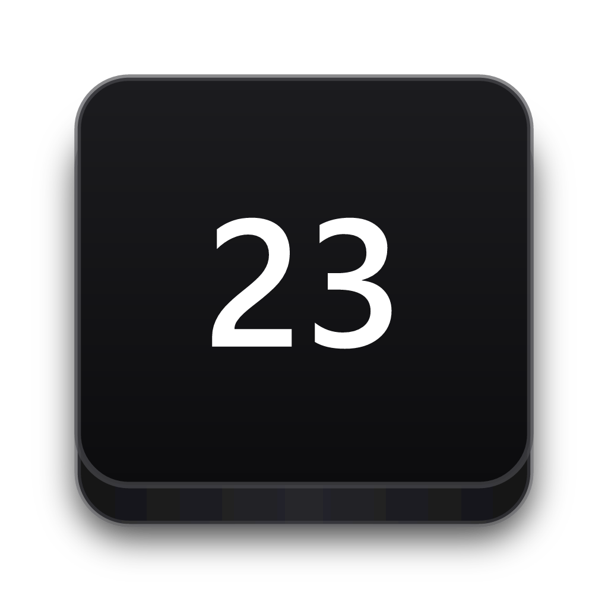

<h1 align="center">
  <br/>
  <strong>Key23</strong>
</h1>

<div align="center">
  
  
  
  
  
</div>

<br/>

> **Key23** is a real-time keyboard and mouse visualizer for Windows — built for streamers, educators, tutorial creators, and anyone who wants their audience to see exactly what they're typing and clicking.

<br/>

---

## ✨ Features

### ⌨️ Keyboard Visualizer

- **Real-time key display** — Every keystroke appears on screen the moment it's pressed, with smooth fade-out animations
- **5 authentic keycap styles** — PBT, Apple, Retro, Minimal, M0116, each with precise 3D rendering
- **Smart key grouping** — Modifier keys (Ctrl, Shift, Alt, Win) are displayed alongside regular keys as a cohesive combination cluster
- **Combination result** — Shows the resulting character when modifier + key combinations are pressed (e.g. `Shift + 1 = !`)
- **Shortcuts-only mode** — Display only keyboard shortcuts involving modifiers, ignoring plain keypresses
- **Adaptive key count** — Automatically calculates how many keys fit in the window width at the current scale; older keys scroll off gracefully when the limit is reached
- **Full key support** — Letters, digits, symbols, F1–F24, arrow keys, media keys, numpad, PrintScreen, ScrollLock, Pause, and more
- **Turkish keyboard layout** — Native support for Turkish QWERTY layout with correct AltGr and Shift character mapping

### 🖱️ Mouse Visualizer

- **Cursor-following indicator** — A minimal floating pill that follows your cursor and lights up on click/scroll
- **Left / Right / Middle click** — Each button fills its corresponding half of the mouse outline when pressed
- **Scroll wheel** — Scroll up/down arrows appear inside the wheel slot when scrolling
- **Configurable distance** — The indicator stays close to your cursor without overlapping it

### 🎨 Theming

- **10 color themes** — Classic, Black, White, Blue, Green, Purple, Rose, Amber, Citrus, Indigo
- **Dual-color custom theme** — Pick separate colors for modifier keys and regular (alpha) keys using an RGB color picker
- **Live color preview** — The settings window preview card updates immediately as you change themes

### 📐 Layout & Positioning

- **Drag-to-place** — A full-screen overlay lets you drag a rectangle to precisely define where the key HUD appears on screen
- **Width + scale control** — When dragging, the width and scale of the HUD are both set simultaneously
- **Scale preview** — Dragging the size slider shows the HUD live on screen so you can judge the real-world size
- **Persistent position** — Your custom position is saved and restored on next launch

### ⚙️ Settings

- **Always-on-top** — The HUD floats above all windows, including fullscreen apps and games
- **Transparent overlay** — Fully transparent background with no borders or boxes behind the keys
- **Single instance** — A second launch focuses the existing window instead of opening a duplicate
- **System tray** — Minimize to tray; click the icon to restore the settings window

---

## 🖼️ Screenshots

> *Keycap styles at a glance*

| PBT | Apple | Retro |
|-----|-------|-------|
| Deep sculpted keycaps with 3D lighting | Flat modern look with rounded corners | Vintage typewriter aesthetic |

| Minimal | M0116 |
|---------|-------|
| Ultra-thin flat labels | Classic IBM Model M-inspired |

---

## 🚀 Getting Started

### Download

Grab the latest `winkeyty.exe` from the [Releases](https://github.com/emirhangungormez/key23/releases) page and run it — no installation required.

### Requirements

- **Windows 10** (version 1809+) or **Windows 11**
- No additional runtimes or dependencies needed

---

## 🛠️ Building from Source

### Prerequisites

| Tool | Version |
|------|---------|
| [Rust](https://rustup.rs/) | 1.77+ |
| [Node.js](https://nodejs.org/) | 18+ |
| [Tauri CLI](https://tauri.app/start/prerequisites/) | 2.x |

### Steps

```bash
# 1. Clone the repository
git clone https://github.com/emirhangungormez/key23.git
cd key23

# 2. Install frontend dependencies
npm install

# 3. Build the frontend
npm run build

# 4. Build the Rust backend (release)
cd src-tauri
cargo build --release

# 5. Run the compiled binary
./target/release/winkeyty.exe
```

### Development (hot-reload)

```bash
npm run tauri dev
```

---

## 🗂️ Project Structure

```
key23/
├── src/                    # TypeScript frontend
│   ├── main.ts             # Settings window UI & logic
│   ├── overlay.ts          # Floating key HUD renderer
│   ├── mouse.ts            # Mouse cursor indicator
│   ├── picker.ts           # Drag-to-place position picker
│   ├── keycap.ts           # Keycap SVG renderers (PBT, Apple, Retro, Minimal, M0116)
│   └── style.css           # Tailwind base styles
├── src-tauri/
│   └── src/
│       ├── main.rs         # Entry point & single-instance mutex
│       ├── lib.rs          # Tauri commands & window management
│       ├── hook.rs         # Low-level Windows keyboard/mouse hooks
│       └── tray.rs         # System tray setup
├── index.html              # Settings window
├── overlay.html            # Transparent floating HUD
├── mouse.html              # Mouse cursor follower
├── picker.html             # Full-screen position picker overlay
└── src-tauri/
    ├── Cargo.toml
    └── tauri.conf.json
```

---

## 🏗️ Architecture

Key23 is built on **Tauri 2** (Rust backend + Web frontend) with multiple webview windows:

```
┌─────────────────────────────────┐
│        Settings Window          │  ← main.ts  (index.html)
│  Themes · Style · Size · Pos    │
└────────────┬────────────────────┘
             │  emitTo / invoke
    ┌────────▼────────┐    ┌────────────────┐
    │   Overlay HUD   │    │  Mouse Pill    │
    │  (overlay.html) │    │ (mouse.html)   │
    │  Key clusters   │    │ Click / scroll │
    └─────────────────┘    └────────────────┘
             ▲
    ┌────────┴────────┐
    │  Picker Window  │
    │ (picker.html)   │
    │ Drag-to-place   │
    └─────────────────┘
```

The **Windows low-level hook** (`WH_KEYBOARD_LL` + `WH_MOUSE_LL`) captures all input globally via `hook.rs`, routes events through a channel to avoid blocking the OS hook thread, then emits Tauri events that the overlay and mouse windows listen to.

---

## ⌨️ Keycap Styles

Each style is implemented as a pure SVG renderer in [`src/keycap.ts`](src/keycap.ts):

| Style | Description | Inspired by |
|-------|-------------|-------------|
| **PBT** | Deep two-tone keycap with 3D underside shadow | PBT double-shot keycaps |
| **Apple** | Flat glass-like key with subtle top gradient | macOS keyboard |
| **Retro** | Chunky sculpted key with front-facing legend | Vintage mechanical keyboards |
| **Minimal** | Ultra-thin text-only label, no visible key body | Minimalist UI |
| **M0116** | IBM-style sculpted key with left-aligned legend | Apple M0116 keyboard |

---

## 🎨 Color Themes

| Theme | Modifier Keys | Alpha Keys |
|-------|--------------|------------|
| Classic | Dark zinc | Slightly lighter zinc |
| Black | Pure black | Pure black |
| White | Light gray | Off-white |
| Blue | Royal blue `#2563eb` | Sky blue `#93c5fd` |
| Green | Emerald `#059669` | Mint `#a7f3d0` |
| Purple | Violet `#7c3aed` | Lavender `#ddd6fe` |
| Rose | Deep rose | Light rose |
| Amber | Warm amber | Light amber |
| Citrus | Yellow-green | Pale citrus |
| Indigo | Deep slate-blue | Steel indigo |
| **Custom** | Any hex color | Any hex color |

---

## 🔧 Settings Reference

| Setting | Description |
|---------|-------------|
| **Klavye HUD** | Enable / disable the key visualizer entirely |
| **Renk Temaları** | Choose from 10 built-in themes or set custom dual colors |
| **Klavye Stili** | Switch between PBT / Apple / Retro / Minimal / M0116 |
| **Ekran Konumu** | Drag-to-place the HUD anywhere on screen |
| **Boyut** | Scale the HUD from 0.7× to 1.4× |
| **Süre** | How long keys remain visible after release (0.5s – 3.0s) |
| **İmleç Yanı Fare Simgesi** | Enable / disable the mouse button indicator |
| **Yalnızca Kısayollar** | Show keys only when a modifier (Ctrl/Shift/Alt/Win) is held |

---

## 🤝 Contributing

Pull requests are welcome! For major changes, please open an issue first.

1. Fork the repo
2. Create your branch: `git checkout -b feat/amazing-feature`
3. Commit your changes: `git commit -m 'feat: add amazing feature'`
4. Push: `git push origin feat/amazing-feature`
5. Open a Pull Request

---

## 📄 License

MIT — see [LICENSE](LICENSE) for details.

---

<div align="center">
  Made with ❤️ by <a href="https://github.com/emirhangungormez">Emirhan Güngörmez</a>
</div>
