<h1 align="center">
  <br/>
  <strong>Key23</strong>
</h1>

<div align="center">
  
  
  
  
  
</div>

<br/>

<p align="center">
  <strong>Key23</strong> is a free, open-source app that visualizes your keyboard and mouse actions in real time for Windows, making demos, presentations, tutorials, and livestreams easier to follow.
</p>

> [!NOTE]
> **Key23** is inspired by and built upon the excellent open-source project **[Keyty](https://github.com/keytyapp/Keyty)** (developed for macOS / iOS). If you are looking for the macOS or iOS version, please check out **[Keyty](https://github.com/keytyapp/Keyty)**. Key23 brings that same elegant input visualization experience natively to Windows with Rust and Tauri.

<br/>

---

## Features

### Keyboard

<div align="center">
  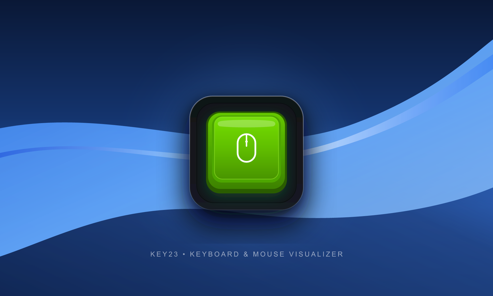
  <br/><br/>
  <p>
    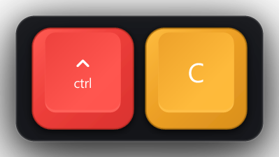&nbsp;&nbsp;
    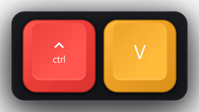&nbsp;&nbsp;
    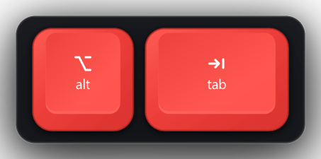&nbsp;&nbsp;
    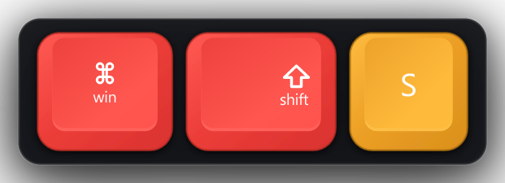
  </p>
</div>

- **Real-time key display** — Every keystroke appears on screen the moment it is pressed, with smooth pop and fade-out animations.
- **Iconic Pod Chassis & 3D Keycaps** — Features the iconic rounded dark pod chassis with vibrant 3D keycaps floating gracefully above your screen.
- **5 Authentic 3D Keycap Styles** — PBT Mechanical, Apple Modern, Retro Beige, Minimal Pill, and M0116 Vintage with mathematical vector depth and lighting.

<div align="center">
  <table>
    <thead>
      <tr>
        <th align="center">PBT Mechanical</th>
        <th align="center">Apple Modern</th>
        <th align="center">Retro Vintage</th>
        <th align="center">Minimal Pill</th>
        <th align="center">M0116 Classic</th>
      </tr>
    </thead>
    <tbody>
      <tr>
        <td align="center">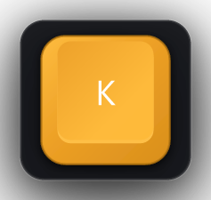</td>
        <td align="center">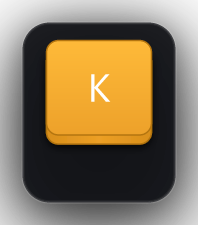</td>
        <td align="center">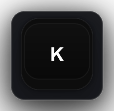</td>
        <td align="center">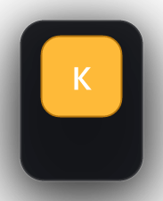</td>
        <td align="center">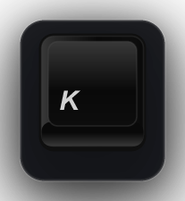</td>
      </tr>
      <tr>
        <td align="center"><sub>Deep sculpted dish</sub></td>
        <td align="center"><sub>Flat rounded glass</sub></td>
        <td align="center"><sub>Vintage mechanical</sub></td>
        <td align="center"><sub>Clean minimal pill</sub></td>
        <td align="center"><sub>Apple M0116 classic</sub></td>
      </tr>
    </tbody>
  </table>
</div>

- **Modifier Combination Evaluation** — Automatically resolves and displays combination results (e.g. `Ctrl` + `C` = `COPY`, `Shift` + `4` = `+`).
- **Shortcuts-Only Mode** — Filter out plain typing to only showcase hotkeys and shortcuts involving modifiers (`Ctrl`, `Shift`, `Alt`, `Win`).
- **Turkish QWERTY & Multi-Layout Support** — Resolves native Windows keyboard layouts using `ToUnicodeEx` for accurate `AltGr` and `Shift` characters.
- **Zero-Latency Win32 Hooks** — Low-level OS hooks (`WH_KEYBOARD_LL`) work seamlessly over fullscreen games, IDEs, and desktop apps.

---

### Mouse

<div align="center">
  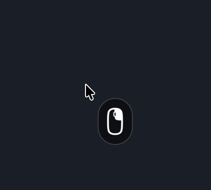
</div>

- **Cursor-Following Companion** — A minimal mouse pill floats gracefully alongside your cursor without blocking your work.
- **Instant Click Highlights** — Real-time visual feedback for left, right, and middle mouse clicks.
- **Interactive Scroll Wheel** — Directional scroll indicators appear inside the wheel slot as you scroll up or down.

---

### Settings & Theming

<div align="center">
  <p>
    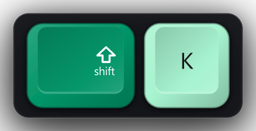&nbsp;&nbsp;
    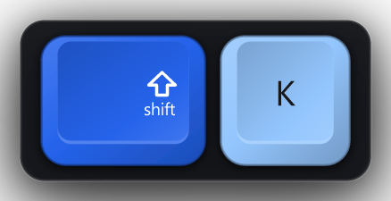&nbsp;&nbsp;
    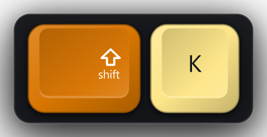&nbsp;&nbsp;
    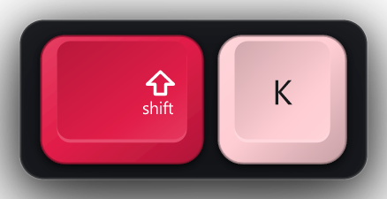&nbsp;&nbsp;
    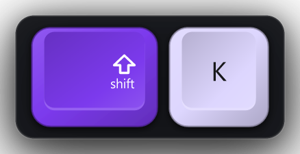
  </p>
</div>

- **10 Dual-Tone Color Themes** — Classic, Stealth Dark, Pure White, Ocean Blue, Emerald Green, Deep Purple, Rose Quartz, Amber Orange, Citrus, Indigo.
- **Custom Dual-Color RGB Picker** — Independently customize colors for modifier keys and alphanumeric character keys.
- **Interactive Drag-to-Place Picker** — Draw a rectangle anywhere on your screen to set the exact HUD position and size.
- **Live Preview & Scale Slider** — Instant feedback for scale, fade delays, and keycap styles before applying.
- **System Tray Integration** — Minimize to tray; click the tray icon to toggle the settings window.

---

## 🚀 Getting Started

### Download Standalone Binary

1. Download the latest **`key23.exe`** from the [Releases](https://github.com/emirhangungormez/key23/releases) page.
2. Run **`key23.exe`** — portable single-file executable, zero installation and zero runtime dependencies required.
3. Start typing or clicking to see the visualizer floating above your screen.
4. Access settings anytime via the system tray icon or by pressing the tray icon.

### Requirements

- **Operating System:** Windows 10 (1809+) or Windows 11 (64-bit).

---

## 🛠️ Building from Source

### Prerequisites

| Tool | Version |
|------|---------|
| [Rust & Cargo](https://rustup.rs/) | 1.77+ |
| [Node.js](https://nodejs.org/) | 18+ |

### Build Steps

```powershell
# 1. Install dependencies
npm install

# 2. Build the frontend
npm run build

# 3. Run in development mode
npm run tauri dev

# 4. Compile optimized standalone Release binary (key23.exe)
npm run tauri build
```

The compiled executable will be located at:
```
src-tauri/target/release/key23.exe
```

---

## 📄 License

This project is licensed under the **[BSD-3-Clause License](LICENSE)**, honoring the original open-source license of [Keyty](https://github.com/keytyapp/Keyty).

Key23 Contributors &copy; 2026.
